# Ponder Schema Visualization

This document provides a visual representation of the Ponder schema for the Olympus Convertible Deposits indexer.

## Entity Relationship Diagram

```mermaid
erDiagram
    Asset ||--o{ DepositAsset : "has many"
    DepositAsset ||--o{ DepositAssetPeriod : "has periods"
    DepositAsset ||--o{ Auctioneer : "has auctioneer"
    DepositAsset ||--o{ DepositRedemptionVaultAssetConfiguration : "has config"

    DepositAssetPeriod ||--o{ ReceiptToken : "generates"
    DepositAssetPeriod ||--o{ ConvertibleDepositPosition : "contains"
    DepositAssetPeriod ||--o{ AuctioneerDepositPeriod : "configured in"
    DepositAssetPeriod ||--o{ Redemption : "redeemed from"
    DepositAssetPeriod ||--o{ DepositFacilityAssetPeriod : "configured in"

    Auctioneer ||--o{ AuctioneerDepositPeriod : "manages"
    Auctioneer ||--o{ AuctioneerSnapshot : "snapshotted"
    Auctioneer ||--o{ ConvertibleDepositAuctioneer_AuctionParametersUpdated : "emits"
    Auctioneer ||--o{ ConvertibleDepositAuctioneer_AuctionResult : "emits"
    Auctioneer ||--o{ ConvertibleDepositAuctioneer_Bid : "receives"
    Auctioneer ||--o{ ConvertibleDepositAuctioneerDepositPeriodEnabled : "emits"
    Auctioneer ||--o{ ConvertibleDepositAuctioneerDepositPeriodDisabled : "emits"

    AuctioneerDepositPeriod ||--o{ AuctioneerDepositPeriodSnapshot : "snapshotted"
    AuctioneerDepositPeriod ||--o{ ConvertibleDepositAuctioneer_Bid : "receives bids"

    DepositFacility ||--o{ DepositFacilityAsset : "manages"
    DepositFacility ||--o{ ConvertibleDepositPosition : "holds"
    DepositFacility ||--o{ ReceiptToken : "issues"
    DepositFacility ||--o{ Redemption : "processes"
    DepositFacility ||--o{ DepositRedemptionVaultAssetConfiguration : "configured in"
    DepositFacility ||--o{ DepositFacilityAssetSnapshot : "snapshotted"

    DepositFacilityAsset ||--o{ DepositFacilityAssetPeriod : "has periods"
    DepositFacilityAsset ||--o{ DepositFacilityAssetSnapshot : "snapshotted"

    DepositFacilityAssetPeriod ||--o{ ConvertibleDepositPosition : "contains"
    DepositFacilityAssetPeriod ||--o{ ConvertibleDepositFacility_CreatedDeposit : "creates"
    DepositFacilityAssetPeriod ||--o{ ConvertibleDepositFacility_ConvertedDeposit : "converts"

    DepositRedemptionVault ||--o{ DepositRedemptionVaultAssetConfiguration : "configures"
    DepositRedemptionVault ||--o{ Redemption : "processes"

    Depositor ||--o{ ConvertibleDepositPosition : "owns"
    Depositor ||--o{ ConvertibleDepositAuctioneer_Bid : "places"
    Depositor ||--o{ Redemption : "initiates"
    Depositor ||--o{ ConvertibleDepositFacility_CreatedDeposit : "creates"
    Depositor ||--o{ ConvertibleDepositFacility_ConvertedDeposit : "converts"

    ConvertibleDepositPosition ||--o{ ConvertibleDepositAuctioneer_Bid : "receives"
    ConvertibleDepositPosition ||--o{ ConvertibleDepositFacility_CreatedDeposit : "created by"
    ConvertibleDepositPosition ||--o{ ConvertibleDepositFacility_ConvertedDeposit : "converted by"
    ConvertibleDepositPosition }o--|| ReceiptToken : "represented by"

    ReceiptToken ||--o{ Redemption : "redeemed"

    Redemption ||--o{ RedemptionLoan : "has loans"
    Redemption ||--o{ DepositRedemptionVault_RedemptionStarted : "started by"
    Redemption ||--o{ DepositRedemptionVault_RedemptionFinished : "finished by"
    Redemption ||--o{ DepositRedemptionVault_RedemptionCancelled : "cancelled by"
    Redemption }o--o| ConvertibleDepositPosition : "may reference"

    RedemptionLoan ||--o{ DepositRedemptionVault_LoanCreated : "created by"
    RedemptionLoan ||--o{ DepositRedemptionVault_LoanRepaid : "repaid by"
    RedemptionLoan ||--o{ DepositRedemptionVault_LoanDefaulted : "defaulted by"
    RedemptionLoan ||--o{ DepositRedemptionVault_LoanExtended : "extended by"

    AuctioneerSnapshot ||--o{ AuctioneerDepositPeriodSnapshot : "contains"
    DepositFacilityAssetSnapshot }o--|| DepositFacility : "for facility"
    DepositFacilityAssetSnapshot }o--|| DepositAsset : "for asset"
```



## Core Entities

### Asset
- **Primary Key**: `(chainId, address)`
- **Fields**: `decimals`, `name`, `symbol`
- **Relations**: `depositAssets` (one-to-many → DepositAsset)

### DepositAsset
- **Primary Key**: `(chainId, asset)`
- **Fields**: `enabled`
- **Relations**:
  - `asset` (many-to-one → Asset)
  - `periods` (one-to-many → DepositAssetPeriod)
  - `auctioneers` (one-to-many → Auctioneer)

### DepositAssetPeriod
- **Primary Key**: `(chainId, depositAsset, depositPeriod)`
- **Fields**: `enabled`
- **Relations**:
  - `depositAsset` (many-to-one → DepositAsset)
  - `positions` (one-to-many → ConvertibleDepositPosition)
  - `receiptTokens` (one-to-many → ReceiptToken)
  - `redemptions` (one-to-many → Redemption)

### Auctioneer
- **Primary Key**: `(chainId, address)`
- **Fields**: `depositAsset`, `majorVersion`, `minorVersion`, `enabled`, `auctionTrackingPeriod`, `tickStep`, `tickStepDecimal`
- **Relations**:
  - `depositAsset` (many-to-one → DepositAsset)
  - `depositPeriods` (one-to-many → AuctioneerDepositPeriod)
  - `snapshots` (one-to-many → AuctioneerSnapshot)

### AuctioneerDepositPeriod
- **Primary Key**: `(chainId, auctioneer, depositAsset, depositPeriod)`
- **Fields**: `enabled`
- **Note**: Current tick data is stored in `AuctioneerDepositPeriodSnapshot`, updated on each bid
- **Relations**:
  - `auctioneer` (many-to-one → Auctioneer)
  - `assetPeriod` (many-to-one → DepositAssetPeriod)
  - `bidEvents` (one-to-many → ConvertibleDepositAuctioneerBid)
  - `snapshots` (one-to-many → AuctioneerDepositPeriodSnapshot)

### DepositFacility
- **Primary Key**: `(chainId, address)`
- **Fields**: `enabled`
- **Relations**:
  - `positions` (one-to-many → ConvertibleDepositPosition)
  - `assets` (one-to-many → DepositFacilityAsset)
  - `assetSnapshots` (one-to-many → DepositFacilityAssetSnapshot)

### DepositFacilityAsset
- **Primary Key**: `(chainId, facility, depositAsset)`
- **Relations**:
  - `facility` (many-to-one → DepositFacility)
  - `depositAsset` (many-to-one → DepositAsset)
  - `periods` (one-to-many → DepositFacilityAssetPeriod)

### DepositFacilityAssetPeriod
- **Primary Key**: `(chainId, facility, depositAsset, depositPeriod)`
- **Fields**: `reclaimRate`, `reclaimRateDecimal`
- **Relations**:
  - `facilityAsset` (many-to-one → DepositFacilityAsset)
  - `assetPeriod` (many-to-one → DepositAssetPeriod)
  - `positions` (one-to-many → ConvertibleDepositPosition)

### DepositRedemptionVault
- **Primary Key**: `(chainId, address)`
- **Fields**: `enabled`, `claimDefaultRewardPercentage`, `claimDefaultRewardPercentageDecimal`
- **Relations**:
  - `assetConfigurations` (one-to-many → DepositRedemptionVaultAssetConfiguration)
  - `redemptions` (one-to-many → Redemption)

### DepositRedemptionVaultAssetConfiguration
- **Primary Key**: `(chainId, redemptionVault, facility, depositAsset)`
- **Fields**: `interestRate`, `interestRateDecimal`, `maxBorrowPercentage`, `maxBorrowPercentageDecimal`
- **Relations**:
  - `redemptionVault` (many-to-one → DepositRedemptionVault)
  - `facility` (many-to-one → DepositFacility)
  - `depositAsset` (many-to-one → DepositAsset)

### ReceiptToken
- **Primary Key**: `(chainId, receiptTokenManager, receiptTokenId)`
- **Fields**: `facility`, `depositAsset`, `depositPeriod`
- **Relations**:
  - `facility` (many-to-one → DepositFacility)
  - `assetPeriod` (many-to-one → DepositAssetPeriod)
  - `positions` (one-to-many → ConvertibleDepositPosition)
  - `redemptions` (one-to-many → Redemption)

### Depositor
- **Primary Key**: `(chainId, address)`
- **Relations**:
  - `positions` (one-to-many → ConvertibleDepositPosition)
  - `redemptions` (one-to-many → Redemption)
  - `loans` (one-to-many → RedemptionLoan)

### ConvertibleDepositPosition
- **Primary Key**: `(chainId, positionId)`
- **Fields**: `txHash`, `block`, `timestamp`, `facility`, `depositor`, `depositAsset`, `depositPeriod`, `receiptTokenManager`, `receiptTokenId`, `initialAmount`, `initialAmountDecimal`, `remainingAmount`, `remainingAmountDecimal`, `conversionPrice`, `conversionPriceDecimal`
- **Relations**:
  - `facility` (many-to-one → DepositFacility)
  - `depositor` (many-to-one → Depositor)
  - `assetPeriod` (many-to-one → DepositAssetPeriod)
  - `receiptToken` (many-to-one → ReceiptToken)

### Redemption
- **Primary Key**: `(chainId, redemptionVault, depositor, redemptionId)`
- **Fields**: `depositAsset`, `depositPeriod`, `facility`, `receiptTokenManager`, `receiptTokenId`, `positionId` (nullable), `amount`, `amountDecimal`, `redeemableAt`
- **Relations**:
  - `redemptionVault` (many-to-one → DepositRedemptionVault)
  - `depositor` (many-to-one → Depositor)
  - `assetPeriod` (many-to-one → DepositAssetPeriod)
  - `facility` (many-to-one → DepositFacility)
  - `receiptToken` (many-to-one → ReceiptToken)
  - `position` (many-to-one → ConvertibleDepositPosition, nullable)
  - `loans` (one-to-many → RedemptionLoan)

### RedemptionLoan
- **Primary Key**: `(chainId, redemptionVault, depositor, redemptionId)`
- **Fields**: `depositAsset`, `depositPeriod`, `facility`, `receiptTokenManager`, `receiptTokenId`, `initialPrincipal`, `initialPrincipalDecimal`, `principal`, `principalDecimal`, `interest`, `interestDecimal`, `createdAt`, `dueDate`, `status`
- **Relations**:
  - `redemption` (many-to-one → Redemption)
  - `redemptionVault` (many-to-one → DepositRedemptionVault)
  - `depositor` (many-to-one → Depositor)

## Snapshot Entities

### AuctioneerSnapshot
- **Primary Key**: `(chainId, block, auctioneer)`
- **Fields**: `timestamp`, `dayInitTimestamp`, `ohmSold`, `ohmSoldDecimal`, `isAuctionActive`, `target`, `targetDecimal`, `tickSize`, `tickSizeDecimal`, `minPrice`, `minPriceDecimal`
- **Relations**:
  - `auctioneer` (many-to-one → Auctioneer)
  - `depositPeriodSnapshots` (one-to-many → AuctioneerDepositPeriodSnapshot)

### AuctioneerDepositPeriodSnapshot
- **Primary Key**: `(chainId, block, auctioneer, depositAsset, depositPeriod)`
- **Fields**: `timestamp`, `currentTickPrice`, `currentTickPriceDecimal`, `currentTickCapacity`, `currentTickCapacityDecimal`
- **Relations**:
  - `auctioneerSnapshot` (many-to-one → AuctioneerSnapshot)
  - `auctioneer` (many-to-one → Auctioneer)
  - `assetPeriod` (many-to-one → DepositAssetPeriod)
  - `auctioneerDepositPeriod` (many-to-one → AuctioneerDepositPeriod)

### DepositFacilityAssetSnapshot
- **Primary Key**: `(chainId, block, facility, depositAsset)`
- **Fields**: `timestamp`, `totalDeposited`, `totalDepositedDecimal`, `pendingRedemption`, `pendingRedemptionDecimal`, `borrowedAmount`, `borrowedAmountDecimal`, `claimableYield`, `claimableYieldDecimal`
- **Relations**:
  - `facility` (many-to-one → DepositFacility)
  - `depositAsset` (many-to-one → DepositAsset)

## Event Entities

All event entities use `(chainId, block, logIndex)` as their composite primary key and include:
- `txHash: hex`
- `timestamp: bigint`
- Foreign keys to relevant entities (auctioneer, facility, depositor, etc.)
- Event-specific fields

### Auctioneer Events (11)
- `ConvertibleDepositAuctioneerEnabled`
- `ConvertibleDepositAuctioneerDisabled`
- `ConvertibleDepositAuctioneerTickStepUpdated`
- `ConvertibleDepositAuctioneerAuctionTrackingPeriodUpdated`
- `ConvertibleDepositAuctioneerDepositPeriodDisableQueued`
- `ConvertibleDepositAuctioneerDepositPeriodDisabled`
- `ConvertibleDepositAuctioneerDepositPeriodEnableQueued`
- `ConvertibleDepositAuctioneerDepositPeriodEnabled`
- `ConvertibleDepositAuctioneerBid`
- `ConvertibleDepositAuctioneerAuctionParametersUpdated`
- `ConvertibleDepositAuctioneerAuctionResult`

### Facility Events (11)
- `ConvertibleDepositFacilityEnabled`
- `ConvertibleDepositFacilityDisabled`
- `ConvertibleDepositFacilityOperatorAuthorized`
- `ConvertibleDepositFacilityOperatorDeauthorized`
- `ConvertibleDepositFacilityAssetCommitCancelled`
- `ConvertibleDepositFacilityAssetCommitWithdrawn`
- `ConvertibleDepositFacilityAssetCommitted`
- `ConvertibleDepositFacilityAssetPeriodReclaimRateSet`
- `ConvertibleDepositFacilityCreatedDeposit`
- `ConvertibleDepositFacilityReclaimed`
- `ConvertibleDepositFacilityConvertedDeposits`
- `ConvertibleDepositFacilityConvertedDeposit`
- `ConvertibleDepositFacilityClaimedYield`

### Redemption Vault Events (12)
- `DepositRedemptionVaultEnabled`
- `DepositRedemptionVaultDisabled`
- `DepositRedemptionVaultClaimDefaultRewardPercentageSet`
- `DepositRedemptionVaultFacilityAuthorized`
- `DepositRedemptionVaultFacilityDeauthorized`
- `DepositRedemptionVaultAnnualInterestRateSet`
- `DepositRedemptionVaultMaxBorrowPercentageSet`
- `DepositRedemptionVaultRedemptionStarted`
- `DepositRedemptionVaultRedemptionFinished`
- `DepositRedemptionVaultRedemptionCancelled`
- `DepositRedemptionVaultLoanCreated`
- `DepositRedemptionVaultLoanRepaid`
- `DepositRedemptionVaultLoanDefaulted`
- `DepositRedemptionVaultLoanExtended`

## Key Design Decisions

### Composite Primary Keys
All entities use composite primary keys based on the Envio ID generation patterns:
- **Address-based**: `(chainId, address)` for contracts, assets, depositors
- **Asset-based**: `(chainId, asset)` for DepositAsset (reuses Asset.address)
- **Period-based**: `(chainId, depositAsset, depositPeriod)` for periods
- **Position-based**: `(chainId, positionId)` for positions
- **Event-based**: `(chainId, block, logIndex)` for events
- **Snapshot-based**: `(chainId, block, auctioneer)` or `(chainId, block, facility, depositAsset)` for snapshots
- **Redemption-based**: `(chainId, redemptionVault, depositor, redemptionId)` for redemptions

### Foreign Key Patterns
Foreign keys that reference composite primary keys use matching column sets:
- **2-column FK**: `(chainId, address)` for simple address references
- **3-column FK**: `(chainId, depositAsset, depositPeriod)` for period references
- **4-column FK**: `(chainId, redemptionVault, depositor, redemptionId)` for redemption references

### Data Type Conventions
- **Addresses**: Stored as `hex` type (lowercase), not `text`
- **BigInt**: Stored as `bigint` type (not `text`)
- **BigDecimal**: Stored as `text` type (decimal normalization handled in application layer)
- **Timestamps**: Stored as `bigint` type
- **Boolean flags**: Stored as `boolean` type

### Snapshot Architecture
- Snapshots use `block` and `timestamp` for querying by time
- No `latestSnapshot` entity - query latest by `timestamp` descending
- Period snapshots link to parent auctioneer snapshot via matching `chainId`, `block`, `auctioneer`
- Facility asset snapshots track incremental counters (totalDeposited, pendingRedemption, borrowedAmount)

### Nullable Foreign Keys
- `Redemption.positionId` is nullable - when not set, the `position` relation is null
- `ConvertibleDepositPosition.conversionPrice` is nullable - set when conversion occurs

## Relations Summary

```
Core Entity Relations:
Asset (1) → (many) DepositAsset
DepositAsset (1) → (many) DepositAssetPeriod
DepositAsset (1) → (many) Auctioneer
DepositAssetPeriod (1) → (many) ConvertibleDepositPosition
DepositAssetPeriod (1) → (many) ReceiptToken
DepositAssetPeriod (1) → (many) Redemption
DepositFacility (1) → (many) ConvertibleDepositPosition
DepositFacility (1) → (many) DepositFacilityAsset
DepositFacilityAsset (1) → (many) DepositFacilityAssetPeriod
DepositFacilityAssetPeriod (1) → (many) ConvertibleDepositPosition
Depositor (1) → (many) ConvertibleDepositPosition
Depositor (1) → (many) Redemption
Auctioneer (1) → (many) AuctioneerDepositPeriod
Auctioneer (1) → (many) AuctioneerSnapshot
AuctioneerDepositPeriod (1) → (many) AuctioneerDepositPeriodSnapshot

Snapshot Relations:
AuctioneerSnapshot (1) → (many) AuctioneerDepositPeriodSnapshot

Redemption Relations:
Redemption (1) → (many) RedemptionLoan
Redemption (0..1) → (1) ConvertibleDepositPosition (nullable FK)
```

## Querying Snapshots

To query the latest snapshot for a facility asset:

```graphql
query LatestFacilityAssetSnapshot($facility: String!, $asset: String!) {
  depositFacilityAssetSnapshots(
    where: {
      facility: { address: { equals: $facility } }
      depositAsset: { asset: { equals: $asset } }
    }
    orderBy: timestamp
    orderDirection: desc
    limit: 1
  ) {
    block
    timestamp
    totalDeposited
    pendingRedemption
    borrowedAmount
    claimableYield
  }
}
```

To query auctioneer snapshot with period snapshots:

```graphql
query AuctioneerSnapshotWithPeriods($auctioneer: String!, $block: BigInt!) {
  auctioneerSnapshot(
    where: {
      auctioneer: { address: { equals: $auctioneer } }
      block: { equals: $block }
    }
  ) {
    ohmSold
    isAuctionActive
    depositPeriodSnapshots {
      depositPeriod
      currentTickPrice
      currentTickCapacity
    }
  }
}
```
