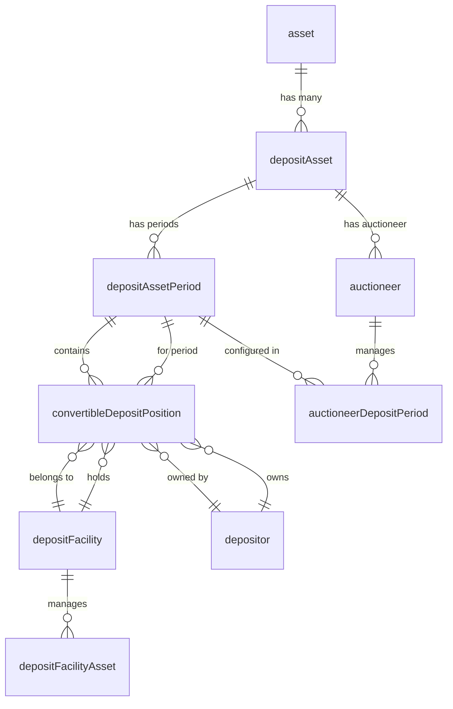

# Ponder Schema Visualization

This document provides a visual representation of the Ponder schema for the Olympus Convertible Deposits indexer.

## Entity Relationship Diagram



## Core Entities with Composite Primary Keys

### Asset
- **Primary Key**: `(chainId, address)`
- **Fields**:
  - `chainId: integer` (PK component)
  - `address: hex` (PK component)
  - `decimals: integer`
  - `name: text`
  - `symbol: text`
- **Relations**:
  - `depositAssets` (one-to-many → DepositAsset)

### DepositAsset
- **Primary Key**: `(chainId, asset)`
- **Fields**:
  - `chainId: integer` (PK component)
  - `asset: hex` (PK component, FK to Asset.address)
  - `enabled: boolean`
- **Relations**:
  - `asset` (many-to-one → Asset via `chainId, asset`)
  - `periods` (one-to-many → DepositAssetPeriod)
  - `auctioneers` (one-to-many → Auctioneer)

### DepositAssetPeriod
- **Primary Key**: `(chainId, depositAsset, depositPeriod)`
- **Fields**:
  - `chainId: integer` (PK component)
  - `depositAsset: hex` (PK component, FK to DepositAsset.asset)
  - `depositPeriod: integer` (PK component)
  - `enabled: boolean`
- **Relations**:
  - `depositAsset` (many-to-one → DepositAsset via `chainId, depositAsset`)
  - `positions` (one-to-many → ConvertibleDepositPosition)

### Auctioneer
- **Primary Key**: `(chainId, address)`
- **Fields**:
  - `chainId: integer` (PK component)
  - `address: hex` (PK component)
  - `depositAsset: hex` (FK to DepositAsset.asset)
  - `majorVersion: integer`
  - `minorVersion: integer`
  - `enabled: boolean`
  - `auctionTrackingPeriod: integer`
  - `tickStep: bigint` (BigInt stored as bigint)
  - `tickStepDecimal: text` (BigDecimal stored as text)
- **Relations**:
  - `depositAsset` (many-to-one → DepositAsset via `chainId, depositAsset`)

### DepositFacility
- **Primary Key**: `(chainId, address)`
- **Fields**:
  - `chainId: integer` (PK component)
  - `address: hex` (PK component)
  - `enabled: boolean`
- **Relations**:
  - `positions` (one-to-many → ConvertibleDepositPosition)

### DepositRedemptionVault
- **Primary Key**: `(chainId, address)`
- **Fields**:
  - `chainId: integer` (PK component)
  - `address: hex` (PK component)
  - `enabled: boolean`
  - `claimDefaultRewardPercentage: bigint` (BigInt stored as bigint)
  - `claimDefaultRewardPercentageDecimal: text` (BigDecimal stored as text)

### Depositor
- **Primary Key**: `(chainId, address)`
- **Fields**:
  - `chainId: integer` (PK component)
  - `address: hex` (PK component)
- **Relations**:
  - `positions` (one-to-many → ConvertibleDepositPosition)

### ConvertibleDepositPosition
- **Primary Key**: `(chainId, positionId)`
- **Fields**:
  - `chainId: integer` (PK component)
  - `positionId: bigint` (PK component)
  - `txHash: hex`
  - `block: bigint`
  - `timestamp: bigint`
  - **Foreign Keys**:
    - `facility` → DepositFacility (via `chainId, facility`)
    - `depositor` → Depositor (via `chainId, depositor`)
    - `depositAsset, depositPeriod` → DepositAssetPeriod (via `chainId, depositAsset, depositPeriod`)
    - `receiptTokenManager, receiptTokenId` → ReceiptToken (to be added)
  - **Amounts**:
    - `initialAmount: bigint` (BigInt stored as bigint)
    - `initialAmountDecimal: text` (BigDecimal stored as text)
    - `remainingAmount: bigint` (BigInt stored as bigint)
    - `remainingAmountDecimal: text` (BigDecimal stored as text)
    - `conversionPrice: bigint` (nullable, BigInt stored as bigint)
    - `conversionPriceDecimal: text` (nullable, BigDecimal stored as text)
- **Relations**:
  - `facility` (many-to-one → DepositFacility)
  - `depositor` (many-to-one → Depositor)
  - `assetPeriod` (many-to-one → DepositAssetPeriod via 3-column FK)

## Key Design Decisions

### Composite Primary Keys
All entities use composite primary keys based on the Envio ID generation patterns:
- **Address-based**: `(chainId, address)` for contracts, assets, depositors
- **Asset-based**: `(chainId, asset)` for DepositAsset (reuses Asset.address)
- **Period-based**: `(chainId, depositAsset, depositPeriod)` for periods
- **Position-based**: `(chainId, positionId)` for positions
- **Event-based**: `(chainId, blockNumber, logIndex)` for events (to be added)

### Foreign Key Patterns
Foreign keys that reference composite primary keys use matching column sets:
- **2-column FK**: `(chainId, address)` for simple address references
- **3-column FK**: `(chainId, depositAsset, depositPeriod)` for period references

### Data Type Conventions
- **Addresses**: Stored as `hex` type (not `text`)
- **BigInt**: Stored as `bigint` type (not `text`)
- **BigDecimal**: Stored as `text` type (decimal normalization handled in application)
- **Timestamps**: Stored as `bigint` type
- **Boolean flags**: Stored as `boolean` type

## Relations Summary

```
Asset (1) → (many) DepositAsset
DepositAsset (1) → (many) DepositAssetPeriod
DepositAsset (1) → (many) Auctioneer
DepositAssetPeriod (1) → (many) ConvertibleDepositPosition
DepositFacility (1) → (many) ConvertibleDepositPosition
Depositor (1) → (many) ConvertibleDepositPosition
```

## Next Steps

This schema includes the core entities for Milestone 1. Additional entities will be added in subsequent milestones:
- Milestone 4-6: Event entities (all `ConvertibleDepositAuctioneer_*`, `ConvertibleDepositFacility_*`, `DepositRedemptionVault_*`)
- Milestone 7: Snapshot entities (`AuctioneerSnapshot`, `DepositFacilitySnapshot`, etc.)
- Milestone 8: Remaining entities (`ReceiptToken`, `Redemption`, `RedemptionLoan`, `DepositFacilityAsset`, etc.)

